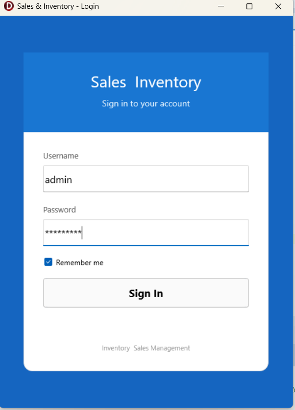
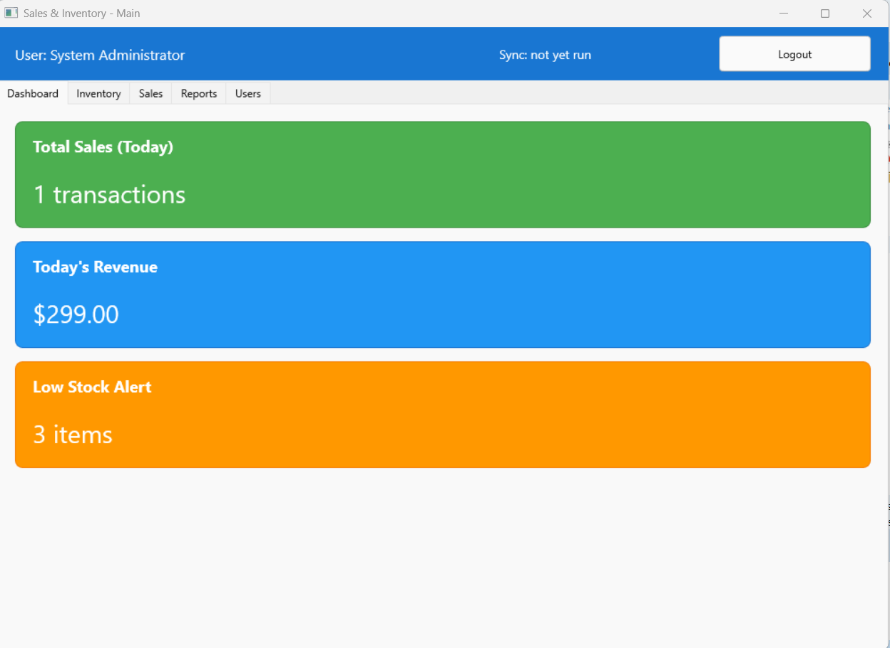
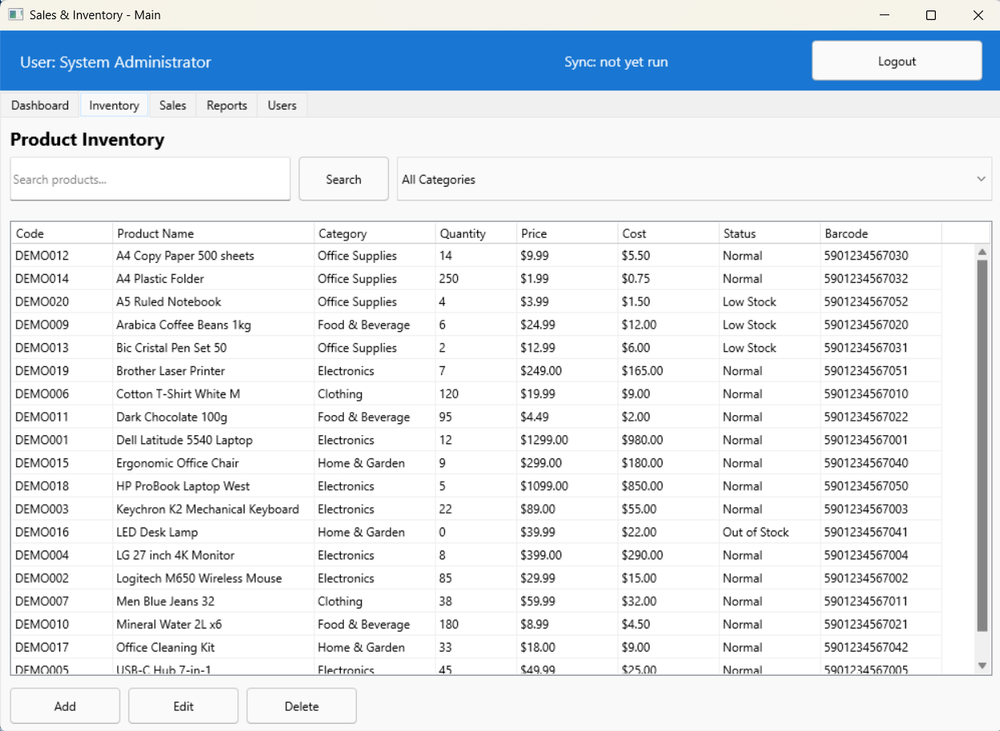
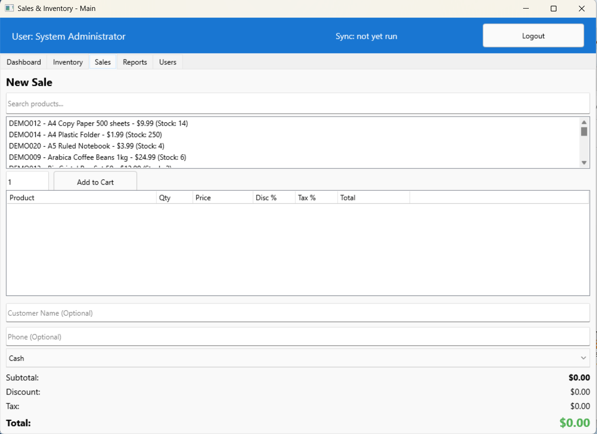
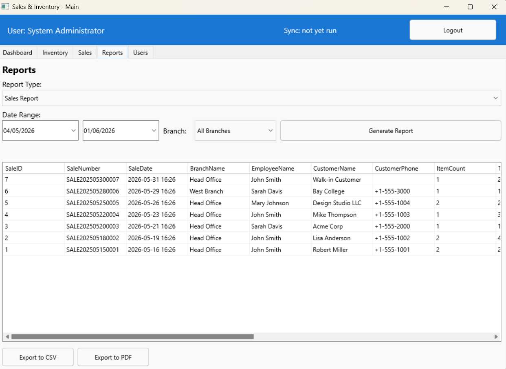
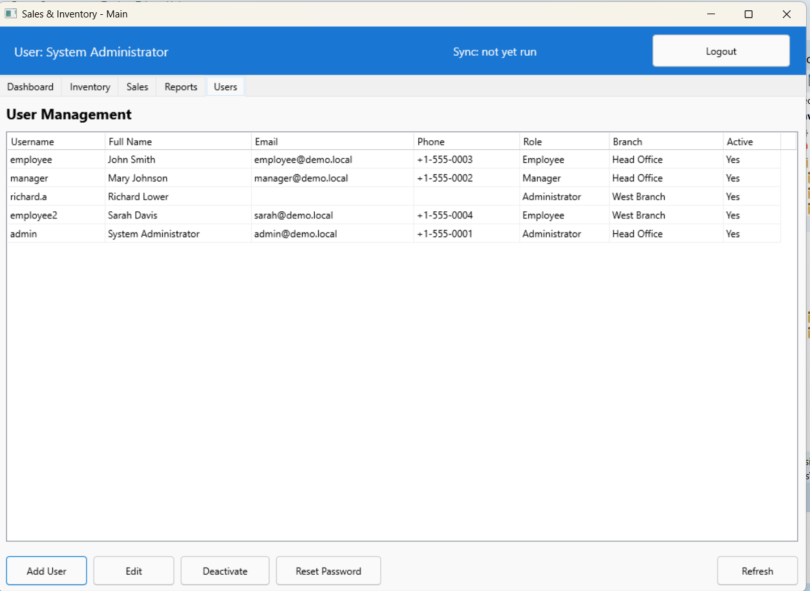

# Inventory & Sales Management System

Cross-platform **Delphi FMX** desktop app for multi-branch inventory, sales, reporting, and user administration. The recommended development setup uses **SQLite** (no database server required). **Win32** is the active build target in the project.

Repository: [github.com/forevertux/delphi_inv_sales_app](https://github.com/forevertux/delphi_inv_sales_app)

## Screenshots

### Login

Sign-in screen (`admin` / `Admin@123` for full access).



### Dashboard

Summary cards and tab navigation (Inventory, Sales, Reports, Users).



### Inventory

Product list with search, category filter, and stock columns.



### Sales

Point-of-sale flow: product search, cart, totals, and payment.



### Reports

Report type, date range, grid results, and Generate Report.



### Users (admin)

User management: list, Add/Edit, Deactivate, Reset Password.



## Features

- **Authentication** — SHA-256 password hashing, roles (Admin, Manager, Employee), session per login
- **Dashboard** — Today's sales count, revenue, low-stock count; quick navigation; **Load Demo Data** (admin)
- **Inventory** — Product CRUD, categories, stock levels, search and filter
- **Sales** — Cart, discounts/tax, payment methods, automatic stock updates
- **Reports** — Sales, inventory, top products, charts; CSV export
- **Users** — Admin-only user management (add, edit, deactivate, reset password)
- **Offline / sync** — SQLite local DB; sync service and `SyncLog` for future server integration

Main modules are implemented as **TFrame** hosts inside `MainForm` tabs (`Inventory`, `Sales`, `Reports`, `Users`).

## Technology

| Item | Details |
|------|---------|
| IDE | RAD Studio 12 Athens (Delphi FMX), **Win32** enabled in `.dproj` |
| UI | FireMonkey (FMX) |
| Data | FireDAC |
| Default DB | **SQLite** (`data\inventory.db`) |
| Optional DB | SQL Server, MySQL, PostgreSQL, Oracle (see `InventorySales.ini.sample`) |

## Quick start (Windows + SQLite)

### Prerequisites

- **RAD Studio 12 Athens** (or compatible Delphi with FMX + FireDAC SQLite)
- **Git**
- No database server needed for local development

### 1. Clone and open

```bash
git clone https://github.com/forevertux/delphi_inv_sales_app.git
cd delphi_inv_sales_app
```

In RAD Studio: **File → Open Project** → `InventorySales.dproj`  
Target platform: **Win32** (Debug).

### 2. Configuration

Create `InventorySales.ini` next to the project root (or copy from sample):

```ini
[Database]
Type=SQLite
Database=data\inventory.db

[Login]
RememberMe=False
Username=
```

For a full template with SQL Server / sync / security options, see `InventorySales.ini.sample`.

### 3. Deploy SQL scripts with the executable

After the first build, copy the `database` folder next to the EXE so schema and demo scripts are found at runtime:

```
Win32\Debug\
  InventorySales.exe
  InventorySales.ini          ← copy here if not already present
  database\
    schema_sqlite.sql
    demo_data_sqlite.sql
  data\
    inventory.db              ← created automatically on first run
```

The app runs `schema_sqlite.sql` on first connect, then loads English demo data from `demo_data_sqlite.sql` when needed.

Details: [database/DEMO_DATA.md](database/DEMO_DATA.md)

### 4. Build and run

1. Build (**Shift+F9**) / Run (**F9**)
2. Log in (demo accounts below)
3. Explore tabs: **Dashboard**, **Inventory**, **Sales**, **Reports**, **Users** (admin only)

### Reset database

1. Close the app  
2. Delete `data\inventory.db` (path from `InventorySales.ini`)  
3. Start again — schema and demo data are recreated  

To reload demo products/sales only (keep schema): log in as **admin** → Dashboard → **Load Demo Data**.

## Demo accounts

| Username | Password | Role |
|----------|----------|------|
| admin | Admin@123 | Administrator |
| manager | Manager@123 | Manager |
| employee | Employee@123 | Employee |
| employee2 | Employee@123 | Employee |

Change these passwords before any production use.

## Roles

| Role | Inventory | Sales | Reports | Users |
|------|-----------|-------|---------|-------|
| Admin | Full | Full | Full | Full |
| Manager | Add/Edit | Full | Full | — |
| Employee | View / sell | Full | Limited | — |

The **Users** tab is hidden for non-admin users.

## Project layout

```
delphi_inv_sales_app/
├── InventorySales.dpr / .dproj / .ini.sample
├── database/
│   ├── schema_sqlite.sql      # SQLite schema (default)
│   ├── demo_data_sqlite.sql   # English demo seed
│   ├── schema.sql             # SQL Server / generic schema
│   └── DEMO_DATA.md
├── src/
│   ├── DataModules/DatabaseModule.pas
│   ├── Entities/
│   ├── Services/              # Auth, Product, Sales, Report, Sync
│   └── Forms/
│       ├── LoginForm, MainForm
│       ├── InventoryForm, SalesForm, ReportsForm, UsersForm  (TFrame)
│       └── ...
├── tests/
├── docs/
├── invdel_*.png               # UI screenshots (this README)
└── README.md
```

## Usage notes

- **Inventory** — Search, category filter, **Add Product** / **Edit** / **Delete** (permissions apply). Product dialogs use `InputQuery` on Windows.
- **Sales** — Products load when the tab opens; add lines, set payment method, **Process Sale**.
- **Reports** — Pick report type and date range → **Generate Report**; export CSV where available.
- **Users** (admin) — **Add User**, **Edit**, **Deactivate**, **Reset Password**, **Refresh**.

## Optional: SQL Server / MySQL / PostgreSQL

1. Create an empty database on your server  
2. Run `database/schema.sql`  
3. Set `InventorySales.ini`:

```ini
[Database]
Type=SQLServer
Server=localhost
Database=InventorySales
Username=sa
Password=YourPassword
WindowsAuth=False
```

Demo auto-load and **Load Demo Data** are oriented toward **SQLite**; server databases use the same schema but require manual data setup.

## Development

```bash
# DUnitX tests (when test project is configured)
dunit-console InventorySales_Tests.dproj
```

Additional guides (if present in the repo):

- [QUICKSTART.md](QUICKSTART.md) — extended walkthrough  
- [INSTALL_RAD_STUDIO_12.md](INSTALL_RAD_STUDIO_12.md) — RAD Studio install and compile tips  
- [docs/DEPLOYMENT_GUIDE.md](docs/DEPLOYMENT_GUIDE.md) — deployment notes  

## Troubleshooting

| Problem | What to check |
|---------|----------------|
| Empty Inventory / Sales / Reports | `database\` folder next to EXE; run app once to create DB |
| Login fails | Use demo passwords above; delete `data\inventory.db` and restart |
| Romanian or old demo text | Admin → **Load Demo Data**, or delete DB and restart (demo v2 is English) |
| Users tab missing | Log in as **admin** |
| SQLite driver error | `sqlite3.dll` in EXE folder or RAD Studio `bin` (see `DatabaseModule.pas`) |

## Security (production)

- Replace all demo passwords  
- Prefer stronger hashing than SHA-256 (extend `HashUtils.pas`)  
- Use encrypted connections for remote databases  
- Do not commit `InventorySales.ini` with real secrets (keep local; see `.gitignore`)

## License

Proprietary — all rights reserved.

---

**Version:** 1.0.0  
**Author:** [forevertux](https://github.com/forevertux)  
**Last updated:** June 2026
